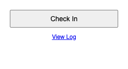
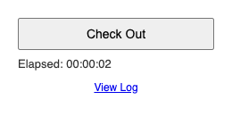
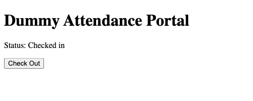
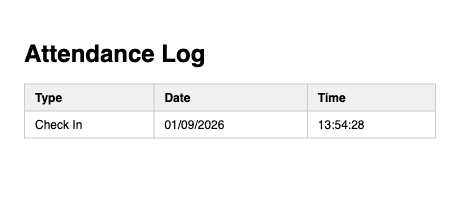

# Cefalo Attendance Check-in

A Chrome extension that checks you in and out of the Cefalo HR attendance
portal from the toolbar, tracks how long you've been checked in, and keeps
a short history of your check-ins and check-outs.

<br clear="left" />

## What it does

- **Check In**: opens the attendance page and clicks the "Check In" button
  for you.
- **Check Out**: opens the attendance page so you can do it yourself — it
  does **not** auto-click. This is so you can finish anything else on the
  page first. The extension notices when you've actually checked out and
  updates itself automatically, live, without needing a page reload.
- **Toolbar badge**: shows how long you've been checked in (e.g. `23m`,
  `1h05m`), so you can see it at a glance without opening the popup.
- **History log**: keeps the last 30 check-in/check-out events with date
  and time.

## Install

1. Download or clone this repository.
2. Open `chrome://extensions` in Chrome.
3. Turn on **Developer mode** (top-right toggle).
4. Click **Load unpacked**.
5. Select the `extension/` folder from this repository.

The icon should appear in your toolbar. If it's hidden behind the puzzle-piece
icon, click the puzzle piece and pin it for easier access.

**Updating:** after pulling new changes, go back to `chrome://extensions` and
click the reload icon (⟳) on the extension's card.

## Using it

Click the toolbar icon to open the popup.

### Check In



Click **Check In**. The extension switches to the attendance page (opening
it if it's not already open) and clicks the check-in button there for you.

### While checked in



The button now reads **Check Out**, and an elapsed-time timer ticks below
it. The toolbar icon also shows a small badge with the elapsed time, so you
don't need to open the popup to see it.

Clicking **Check Out** at this point does **not** check you out — it just
switches you to the attendance page, so you can do whatever else you need
to there first. When you're ready, click the actual checkout button on the
page yourself:



The extension detects this automatically and updates the popup and badge
within about a second — no reload needed.

### View Log



Click **View Log** in the popup to open a page listing your recent
check-ins and check-outs, newest first (last 30 kept).

## Local testing

This repo includes a dummy attendance page (`test-page/`) with the same
Check In/Check Out button behavior as the real portal, so the extension can
be exercised without touching the real site. See
`docs/superpowers/specs/2026-09-01-attendance-checkin-extension-design.md`
and `docs/superpowers/plans/2026-09-01-attendance-checkin-extension.md`
for the full design and how it was built.

To run it:

```bash
cd test-page && python3 -m http.server 8000
```

Then open `http://localhost:8000/` in a tab before clicking Check In in the
popup — the extension will only reuse a local tab if you set
`INCLUDE_LOCALHOST_TARGET = true` in `extension/background.js` (it's off by
default so an unrelated local dev server never gets hijacked).
